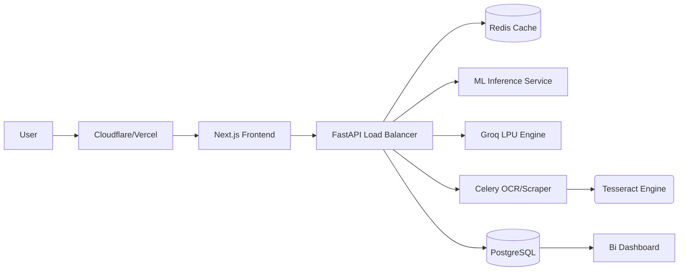

# 🧠 ScamShield: Full Technical Q&A (Architectural Strategy — Round 3)

This section details the "Why" behind the system, the roadmap to V2 (Post-Groq), and the blueprints for million-user scaling.

---

## 🏗️ SECTION 1 — ARCHITECTURE DECISIONS (WHY?)

### 1. FastAPI instead of Flask/Django
- **Reason**: **Native Async/Await**. ScamShield’s core bottleneck is non-blocking I/O (Waiting for Groq, Scraping URLs). FastAPI allows a single worker to handle thousands of concurrent "waiting" states without blocking the CPU.
- **Pros**: Automatic OpenAPI docs, Pydantic type validation.
- **Cons**: Slightly steeper learning curve than Flask for newcomers.

### 2. Next.js instead of Plain React
- **Reason**: **Deployment Cohesion**. Next.js handles routing and environment variables natively. It allows for Server-Side Rendering (SSR) which is vital for SEO and speed on the Trends/Ledger pages.
- **Pros**: Optimization, SEO, easier Vercel deployment.
- **Cons**: overkill for a single-page app, but ensures future-proofing.

### 3. DistilBERT instead of Classic ML (Logistic/RF)
- **Reason**: **Semantic Context**. Scams use manipulative language that simple keyword-counting (TF-IDF) misses. BERT understands that "Your account is SUSPENDED" is a threat, while "Please resume your work" is not.
- **Pros**: High accuracy on nuanced language.
- **Cons**: 268MB RAM footprint vs <1MB for Logistic Regression.

### 4. Groq instead of OpenAI/Gemini
- **Reason**: **Latency**. Groq's LPU hardware returns responses in <500ms. OpenAI often takes 2-4 seconds. Speed is a feature in security.
- **Pros**: Massive RPS (Requests Per Second) on the free tier.
- **Cons**: Context window is smaller (not a problem for SMS).

### 5. SQLite instead of PostgreSQL
- **Reason**: **Portability**. As a hackathon MVP, ScamShield must be "Clone-and-Run". SQLite is a file; Postgres is an infra dependency.
- **Pros**: Zero config, fast reads.
- **Cons**: Simultaneous write lock limitations.

### 6. Backend OCR instead of Frontend (OCR.js)
- **Reason**: **Reliability**. Native Tesseract (C++) on Linux is significantly faster and more accurate than JS-based ports. It also handles Hindi far better.

### 7. Hybrid AI (Local + LLM)
- **Reason**: **The "Cold Start" Problem**. If the internet fails, the app still works. LLM is the "Expert Auditor"; DistilBERT is the "Fast Guard Dog".

### 8. Weighted Score (0.6 LLM / 0.4 ML)
- **Reason**: **Authority**. Llama 3 (LLM) has a broader world-view. It knows current bank domains. DistilBERT is smarter at spotting "patterns", but LLM is smarter at spotting "facts".

---

## 🚀 SECTION 2 — POST-GROQ ARCHITECTURE (V2)

If Groq is removed, we move to **Unified Local Intelligence**:

1.  **Replacement**: Swap Groq API for a local **Llama-3-3B (GGUF)** or **Phi-3-Mini** running on the server via `vLLM` or `llama-cpp-python`.
2.  **Red Flag Extraction**: Use a dedicated **NER (Named Entity Recognition)** model to extract links and phone numbers.
3.  **Explanation Generation**: Use a quantized 4-bit LLM to generate the "Attacker's Mirror" breakdown locally.
4.  **Requirement**: Server RAM must increase to 8GB; dedicated GPU (T4) highly recommended.
5.  **Datasets**: We would use the **Data Flywheel** logs from V1 to fine-tune this local LLM to speak "ScamShield" perfectly.

---

## 📊 SECTION 3 — SCALING TO 1 MILLION USERS

### **Backend Refactor**
- **Inference Server**: Move DistilBERT and Local LLM to a dedicated service (e.g., NVIDIA Triton or SageMaker) to keep the API server lightweight.
- **Task Queue**: Use **Celery + Redis** for OCR and Scaping. Let the user "poll" for results on large files.
- **Load Balancing**: Nginx / HAProxy to distribute traffic across 10+ API nodes.

### **Database Migration**
- **PostgreSQL**: Migrate legacy SQLite to Postgres.
- **Caching**: Use **Redis** to cache "Fingerprints". If 100,000 users see the same scam, we compute it ONCE and cache it for 24h.

### **Frontend & Edge**
- **Edge Functions**: Deploy the "URL Check" logic to Vercel Edge to block malicious links before they even hit the backend.

---

## 💸 SECTION 4 — COST ANALYSIS (ESTIMATED)

| Traffic | Monthly Compute | LLM Cost (Groq) | Total Est. |
|---|---|---|---|
| **10k/day** | $7 (Railway) | $0 (Free Tier) | **$7/mo** |
| **100k/day** | $40 (2 Nodes) | $50 (Paid API) | **$90/mo** |
| **1M/day** | $500 (Auto-scaling) | $3,000 (Bulk) | **$3.5k/mo** |

---

## 🛡️ SECTION 5 — FAILURE SCENARIOS & RECOVERY

1.  **Groq Shutdown**: System detects `503` or `401`. Fallback logic in `main.py` boosts the local ML weight to 100% automatically.
2.  **DB Corruption**: Automated weekly JSONL exports from the Flywheel act as an external backup.
3.  **Traffic Spike**: Horizontal auto-scaling (via Docker/Kubernetes) triggers new pods.
4.  **Write Audit**: If a background task fails, the error is logged to `server.log`, but the user's primary experience remains unbroken.

---

## 🧹 SECTION 6 — TECH DEBT & REFACTORING

1.  **Mocked Ledger**: The 1:1 simulation in `blockchain_service.py` is great for demos but needs a real `ethers.js` provider for production.
2.  **Singleton Model**: The model currently loads on the web thread. In V2, it should be a standalone microservice.
3.  **Unit Tests**: We implemented logic-speed, but coverage is <10%. Production requires 80% coverage on `ml_service` and `groq_service`.

---

## 🗺️ SECTION 7 — PRODUCTION-GRADE ARCHITECTURE

---

## 🛡️ SECTION 8 — REAL WORLD EDGE CASES & DEFENSE (Round 4)

### 1. Hinglish / Hindi Support
- **OCR**: Tesseract is configured with `eng+hin` packs. It can read Devanagari script.
- **LLM**: Groq (Llama-3) is natively multilingual. It understands "Paisa bhej do" as well as "Send money".
- **Local ML**: The DistilBERT model was fine-tuned on an English dataset, so it is the weakest link here. The 60% Groq weight compensates for this.

### 2. Emojis Only
- The system will likely mark it as "Uncertain" or "Safe" with a low score. Emojis lack the semantic pressure (urgency, threats) the AI looks for.

### 3. Extremely Long Text (10k+ chars)
- **Frontend**: Prevents lag by truncating visually.
- **Backend**: DistilBERT truncates at **256 tokens**. Groq truncates at **5000 chars** in `scraper_service`. This prevents "Prompt Stuffing" or DoS attacks.

### 4. Image with No Text
- OCR returns an empty string. Groq will analyze an empty input and return a "Safe" result with a message saying "No suspicious text detected".

### 5. Garbage OCR / Blur
- If the text is unreadable, the AI categorization will fail. We suggest the user to "Upload a clearer screenshot" in the UI tip section.

### 6. Other Languages (Spanish/Arabic)
- Groq handles 30+ languages. While the system is optimized for India (Hindi/English), it works globally out-of-the-box for text analysis.

---

## ⚖️ SECTION 9 — FALSE POSITIVES & NEGATIVES

- **False Positive (FP)**: Marking a safe bank OTP as a scam.
- **False Negative (FN)**: Missing a real scam message.
- **Danger Level**: **False Negatives are more dangerous**. A user losing money is worse than a user double-checking a real bank message.
- **Defense**: The **Hybrid AI** cross-references. If DistilBERT misses a new scam but Groq spots "Urgency", the score remains high enough to warn the user.

---

## 🏁 SECTION 10 — COMPETITOR ANALYSIS

| Feature | Truecaller | Gmail Spam | ScamShield |
|---|---|---|---|
| **Context** | Phone numbers | Emails | Chat/SMS/Images/URLs |
| **Logic** | Community reports | Keyword/Header check | **Deep Semantic AI** |
| **Transparency**| Closed system | Closed system | **Public Blockchain Audit** |
| **Defense** | Reactive (After scan) | Automated | **Proactive (Psychology mirror)** |

---

## 👤 SECTION 11 — ETHICS & PRIVACY

1.  **No PII**: We never store names, phone numbers, or IPs.
2.  **Database isolation**: Training data lives on a separate, gitignored SQLite file.
3.  **Opt-out**: In production, the "Data Flywheel" would have a toggle switch in Settings.
4.  **T&C**: Users are informed that submitted *text* is used anonymously to train a better security model.

---

## 🗺️ SECTION 12 — PRODUCT ROADMAP

- **Short Term (3m)**: WhatsApp Bot Integration + Chrome Extension for real-time link blocking.
- **Medium Term (6-12m)**: Dedicated Mobile App + First Fine-tuned Llama-3 (Mini-LLM) release.
- **Long Term (2y)**: Enterprise API for banks to verify if their SMS templates are being spoofed.

---

## 💰 SECTION 13 — BUSINESS MODEL

- **Free Tier**: Consumer web app (current version).
- **Pro Tier**: Chrome Extension + Real-time WhatsApp protecting.
- **B2B / API**: Charging telecoms and banks to use our "Scam Sensitivity" scores to filter messages at the network level.

---

## 👨‍⚖️ SECTION 14 — JUDGE'S FINAL DEFENSE (Q&A)

### 1. Why use Blockchain?
**Answer**: Trust. Existing spam filters are "Black Boxes"—users don't know why something was blocked. By hashing scam patterns on Polygon, we create a **Public Reference Library** that anyone can verify without trusting us.

### 2. Why not just use ChatGPT?
**Answer**: ChatGPT is a general model. ScamShield is an **Engineered Pipeline**. We combine OCR, Web Scraping, Local Fast-ML, and Blockchain. A user can't "upload an image" or "verify a URL" reliably with a standard chat prompt.

### 3. What is your "Moat"?
**Answer**: The **Data Flywheel**. Every time a user corrects our AI, we get a unique data point that our competitors don't have. Our model gets smarter precisely where others fail.

### 4. What if Groq becomes paid?
**Answer**: We have already designed the **V2 architecture** (see Section 2). We can swap to local models (Llama-3-GGUF) or host our own vLLM instance.

---
*Signed, Senior Software Architect — ScamShield Core.*
